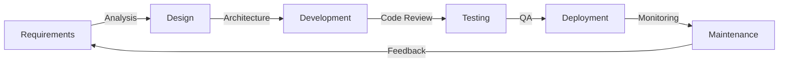

<div align="center">


### 💼 Full-Stack Developer • ☁️ Cloud Enthusiast • 🚀 Problem Solver

<p align="center">
  <a href="https://linkedin.com/in/sundar-lingam-8407a5221">
    
  </a>
  <a href="mailto:sundarlingam272000@gmail.com">
    
  </a>
  <a href="https://github.com/Sudharsen27">
    
  </a>
  <a href="#">
    
  </a>
</p>


</div>

##  Professional Profile

```typescript
const developer = {
    name: "Sundar Lingam",
    role: "Software Development Engineer",
    location: "Chennai, Tamil Nadu 🇮🇳",
    
    expertise: {
        frontend: ["React", "Next.js", "TypeScript"],
        backend: ["Node.js", "Express", "Spring Boot"],
        database: ["PostgreSQL", "MongoDB", "MySQL"],
        cloud: ["AWS", "Docker", "CI/CD"]
    },
    
    focus: [
        "Full-Stack Development",
        "Cloud Architecture",
        "RESTful APIs"
    ],
    
    learning: ["System Design", "AWS", "Kubernetes"],
    status: "Open to opportunities"
};
```


##  Technology Stack

<div align="center">

<table>
<tr>
<td width="50%" valign="top">

### 🎨 Frontend Development

<p align="center">
  
</p>

**Frameworks & Libraries**
```yaml
Core: React.js, Next.js 14
Languages: JavaScript (ES6+), TypeScript
Styling: Tailwind CSS, CSS3, SCSS
State Management: Context API, Redux Toolkit
UI Components: Shadcn/ui, Material-UI
```

**Key Competencies:**
- ⚡ Single Page Applications (SPA)
- 🎯 Server-Side Rendering (SSR)
- 📱 Responsive & Mobile-First Design
- ♿ Web Accessibility (WCAG)
- 🎨 Modern UI/UX Implementation

</td>
<td width="50%" valign="top">

### ⚙️ Backend Development

<p align="center">
  
</p>

**Frameworks & Tools**
```yaml
Runtime: Node.js (Express.js)
Enterprise: Java (Spring Boot)
Authentication: JWT, OAuth 2.0, Passport.js
API Design: RESTful, GraphQL
Testing: Jest, Mocha, JUnit
```

**Key Competencies:**
- 🔐 Secure Authentication & Authorization
- 🌐 RESTful API Architecture
- 📊 Microservices Design Patterns
- 🔄 WebSocket & Real-time Communication
- ✅ API Testing & Documentation

</td>
</tr>
<tr>
<td width="50%" valign="top">

### 🗄️ Database & Data Management

<p align="center">
  
</p>

**Database Technologies**
```yaml
Relational: PostgreSQL, MySQL
NoSQL: MongoDB, Redis
ORMs: Sequelize, Prisma, Hibernate
Query Optimization: Indexing, Caching
Data Modeling: ER Diagrams, Schema Design
```

**Key Competencies:**
- 📊 Database Schema Design & Optimization
- 🔍 Complex Query Writing & Performance Tuning
- 🔄 Data Migration & Seeding
- 💾 Redis Caching Strategies
- 📈 Database Monitoring & Scaling

</td>
<td width="50%" valign="top">

### ☁️ DevOps & Cloud Services

<p align="center">
  
</p>

**Cloud & Infrastructure**
```yaml
Cloud Provider: AWS (EC2, S3, RDS, Lambda)
Containerization: Docker
Version Control: Git, GitHub, GitLab
CI/CD: GitHub Actions, Jenkins
Deployment: Vercel, Railway, Netlify
Web Servers: Nginx, Apache
```

**Key Competencies:**
- ☁️ AWS Cloud Architecture & Deployment
- 🐳 Docker Containerization
- 🔄 CI/CD Pipeline Implementation
- 📦 Automated Testing & Deployment
- 🔧 Infrastructure as Code (IaC)

</td>
</tr>
</table>


</div>


##  Featured Projects

<div align="center">

### 🏥 **Medilink – Healthcare Appointment Management System**


*A comprehensive full-stack healthcare platform revolutionizing patient-provider interactions*

</div>

<table>
<tr>
<td width="50%" valign="top">

### 🎨 Frontend Architecture
- ⚛️ **React.js** - Component-based architecture with hooks
- 🎯 **Axios** - Promise-based HTTP client for API calls
- 🧭 **React Router v6** - Declarative routing solution
- 💅 **Tailwind CSS** - Utility-first styling framework
- 🎭 **React Context** - Global state management
- 📱 **Responsive Design** - Mobile-first approach
- 🔔 **Toast Notifications** - Real-time user feedback
- ✅ **Form Validation** - Client-side input validation

**Technical Highlights:**
```javascript
✓ Custom hooks for reusable logic
✓ Lazy loading & code splitting
✓ Protected routes implementation
✓ Optimized bundle size
```

</td>
<td width="50%" valign="top">

### ⚙️ Backend Architecture
- 🟢 **Node.js** - JavaScript runtime environment
- 🚀 **Express.js** - Fast, minimal web framework
- 🐘 **PostgreSQL** - Relational database system
- 🔐 **JWT** - Secure token-based authentication
- 🛡️ **Bcrypt** - Password hashing & encryption
- 📝 **Joi** - Schema validation middleware
- 🔒 **Helmet.js** - Security headers protection
- ⚡ **Connection Pooling** - Optimized DB queries

**Technical Highlights:**
```javascript
✓ RESTful API design principles
✓ Role-based access control (RBAC)
✓ Error handling middleware
✓ Request rate limiting
```

</td>
</tr>
</table>

<div align="center">

**🎯 Core Features & Capabilities**

| Feature | Description |
|---------|-------------|
| 🔐 **Authentication System** | Secure JWT-based auth with role management (Patient/Doctor/Admin) |
| 📅 **Smart Scheduling** | Real-time appointment booking with conflict prevention algorithm |
| 👥 **User Management** | Comprehensive profile management and role-based dashboards |
| 📊 **Analytics Dashboard** | Visual insights for appointments, patients, and system metrics |
| 🔔 **Notification System** | Email notifications for appointment confirmations and reminders |
| 🔍 **Advanced Search** | Filter and search functionality for doctors and appointments |
| 📱 **Responsive UI** | Seamless experience across desktop, tablet, and mobile devices |
| 🛡️ **Security Features** | Input sanitization, SQL injection prevention, XSS protection |

<br>

[](https://github.com/Sudharsen27/medilink-frontend)
[](https://github.com/Sudharsen27/medilink-backend)
[](#)
[](#)

**Tech Stack:** `React` `Node.js` `Express` `PostgreSQL` `JWT` `Tailwind CSS` `Axios` `Bcrypt`

</div>


## 📊 GitHub Performance Metrics

<div align="center">
  
<a href="https://github.com/Sudharsen27">
  
  
</a>

</div>

<div align="center">
  
</div>

<div align="center">
  
</div>

<div align="center">

### 🏆 GitHub Achievements

<p align="center">
  
</p>

</div>


## 🎓 Continuous Learning & Development

<div align="center">

<table>
<tr>
<td width="50%" align="center">

### 🎯 Currently Mastering


<br><br>

```diff
+ Microservices Architecture & Design Patterns
+ Advanced React Performance Optimization
+ AWS Solutions Architecture (SAA-C03)
+ System Design & Scalability Principles
+ GraphQL Federation & Advanced Patterns
+ Docker Orchestration with Kubernetes
```

**📚 Learning Resources:**
- AWS Certified Solutions Architect
- System Design Interview Prep
- Advanced Node.js Architecture
- Design Patterns & Best Practices

</td>
<td width="50%" align="center">

### 🚀 Upcoming Focus Areas


<br><br>

```diff
# Container Orchestration (Kubernetes, Docker Swarm)
# Advanced GraphQL Implementation
# Event-Driven Architecture (Kafka, RabbitMQ)
# Serverless Computing (AWS Lambda, Functions)
# Infrastructure as Code (Terraform, CloudFormation)
# Performance Monitoring & Observability
```

**🎯 2024 Goals:**
- Contribute to major open-source projects
- Build production-grade microservices
- Master cloud-native development
- Launch personal SaaS product

</td>
</tr>
</table>

</div>


## 💼 Professional Experience & Skills

<div align="center">

### 🛠️ Development Workflow



### 💡 Core Competencies

<table>
<tr>
<td align="center" width="25%">

<br><strong>Full-Stack Development</strong>
<br><sub>End-to-end application development with modern frameworks and best practices</sub>
</td>
<td align="center" width="25%">

<br><strong>Cloud Architecture</strong>
<br><sub>Designing scalable cloud-native applications on AWS platform</sub>
</td>
<td align="center" width="25%">

<br><strong>Security Best Practices</strong>
<br><sub>Implementing authentication, authorization, and data protection</sub>
</td>
<td align="center" width="25%">

<br><strong>Performance Optimization</strong>
<br><sub>Code optimization, caching strategies, and scalability solutions</sub>
</td>
</tr>
</table>

</div>


## 🤝 Let's Connect & Collaborate

<div align="center">


### 📬 Get In Touch

<a href="mailto:sundarlingam272000@gmail.com">
  
</a>

<a href="https://linkedin.com/in/sundar-lingam-8407a5221">
  
</a>

<a href="https://github.com/Sudharsen27">
  
</a>

<a href="#">
  
</a>

<br><br>

### 💼 Open For Opportunities

<table>
<tr>
<td align="center" width="25%">

<br><strong>Full-Time Positions</strong>
<br><sub>Software Development Engineer roles</sub>
</td>
<td align="center" width="25%">

<br><strong>Freelance Projects</strong>
<br><sub>Web & mobile application development</sub>
</td>
<td align="center" width="25%">

<br><strong>Open Source</strong>
<br><sub>Contributing to community projects</sub>
</td>
<td align="center" width="25%">

<br><strong>Tech Discussions</strong>
<br><sub>Always eager to learn and share</sub>
</td>
</tr>
</table>

### ⚡ Fun Fact


</div>


<div align="center">

### 📈 Profile Analytics


---

### 🐍 Contribution Snake

<picture>
  <source media="(prefers-color-scheme: dark)" srcset="https://raw.githubusercontent.com/Sudharsen27/Sudharsen27/output/github-contribution-grid-snake-dark.svg">
  <source media="(prefers-color-scheme: light)" srcset="https://raw.githubusercontent.com/Sudharsen27/Sudharsen27/output/github-contribution-grid-snake.svg">
  
</picture>

---


**⭐ From [Sudharsen27](https://github.com/Sudharsen27) • Built with ❤️ and lots of ☕**

</div>
